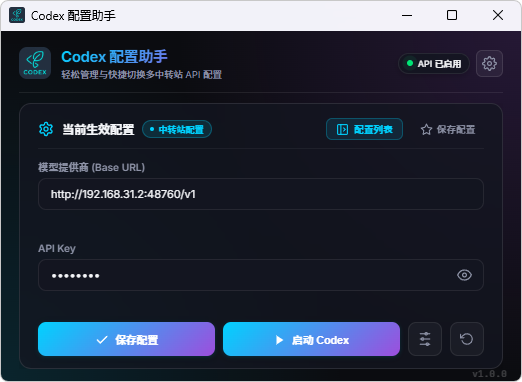

# Codex 配置助手 (Codex Config Manager)

<p align="center">
  <b>专为 Codex / ChatGPT 桌面端设计的轻量级配置中转与进程管理工具</b>
</p>

<p align="center">
  
  
  
  
  
  
</p>

<p align="center">
  
</p>

---

## 📖 项目简介

**Codex 配置助手** 是一款专为 Codex (ChatGPT) 桌面客户端打造的高效辅助工具。采用超紧凑窗口设计（520 × 350 px），旨在以极低系统资源占用提供中转站预设切换、模型参数调整与客户端启动调度能力。

核心设计严格遵循**非破坏性配置修补**与**环境隔离**原则，保障外部应用配置的安全稳定。

---

## ✨ 核心特性

- ⚡ **当前生效配置管理 (Live Config)**：直观查看与修改当前生效的 Base URL、API Key，支持一键热更保存及敏感内容快速复制。
- 🚀 **进程调度与一键拉起 (Process Lifecycle)**：支持在工具内一键拉起或重启 Codex 客户端；启动前自动保存配置，内置进程销毁与互斥锁释放探测（1.5s 轮询），杜绝单实例锁竞态与控制台黑框残留。
- 📑 **多中转站配置库 (Preset Library)**：支持管理多套中转服务商预设，内置 LingAI、智谱 GLM 等默认方案，支持一键切换并覆写当前生效配置。
- 🎛️ **次级扩展配置抽屉 (80% Drawer)**：采用底部滑出式抽屉，按需配置模型名称（`model`）等扩展参数，保持主界面高频操作极致纯粹。
- ⚙️ **系统级偏好设置 (System Settings)**：提供全屏沉浸式设置弹窗，具备真实的物理可执行文件路径检测能力（支持动态探测运行中进程及 Windows Store 真实安装位置）。
- 🛡️ **非破坏性 TOML 修补 (Safe TOML Patching)**：读写 `config.toml` 时仅针对目标字段增量修改，完整保留原文件中的用户自定义注释、结构排列与未纳管字段。
- 🔄 **一键安全重置 (Safe Reset)**：配备多样式通用确认弹窗防误触，一键重置为官方默认设置并清除自定义 API 鉴权。
- 🧪 **环境与数据严格隔离 (Dev/Prod Isolation)**：非 Release 调试环境下自动读写带有 `_dev` 后缀的配置文件，开发调试完全不污染用户生产环境。

---

## 🏛️ 领域概念与架构规范

本项目对领域概念执行严格的分离规范：

| 维度 | 配置 (Config) | 设置 (Settings) |
| :--- | :--- | :--- |
| **管理对象** | 外部应用 (Codex) 的运行参数 | 本管理工具自身的系统偏好与运行时行为 |
| **涵盖范围** | API Key、Provider URL、自定义 Model、中转预设 | 客户端可执行文件路径、自动拉起与重启行为 |
| **存储载体** | `~/.codex/config.toml` 与 `~/.codex/auth.json` | `~/.codex/settings.json` |
| **交互载体** | 主卡片与 80% 高度「更多配置」抽屉 | 100vw × 100vh 全屏模态「设置」弹窗 |

---

## 🛠️ 技术栈

- **桌面内核**：[Tauri 2](https://v2.tauri.app/) (Rust)
- **前端视图**：[Vue 3](https://vuejs.org/) (Composition API, `<script setup>`)
- **开发语言**：TypeScript / Rust
- **构建工具**：[Vite](https://vitejs.dev/)
- **样式方案**：Sass (SCSS) 模块化，极简桌面暗黑设计
- **测试框架**：[Vitest](https://vitest.dev/) (前端) + Cargo Test (Rust)

---

## 📂 目录结构

```text
codex-config-manager/
├── src/                          # 前端源码
│   ├── assets/                   # 静态图标与多平台资源
│   ├── components/               # Vue 业务组件
│   │   ├── config/               # 生效配置卡片子组件
│   │   │   ├── ConfigCardHeader.vue  # 配置卡片头部
│   │   │   └── ConfigCardActions.vue # 启动与保存操作栏
│   │   ├── settings/             # 通用设置控件与弹窗
│   │   │   ├── SettingItem.vue       # 表单项通用容器
│   │   │   ├── SettingInput.vue      # 文本输入框
│   │   │   ├── SettingSwitch.vue     # 开关控件
│   │   │   ├── SettingPathPicker.vue # 物理路径选择器
│   │   │   └── SettingsModal.vue     # 全屏设置弹窗
│   │   ├── AppHeader.vue         # 顶部标题栏与快捷入口
│   │   ├── ConfigDrawer.vue      # 80% 高度扩展配置抽屉
│   │   ├── ConfirmModal.vue      # 通用二次确认弹窗
│   │   ├── CurrentConfigCard.vue # 生效配置主卡片
│   │   ├── PresetListModal.vue   # 中转配置库列表
│   │   ├── PresetModal.vue       # 预设编辑与新增弹窗
│   │   └── ToastMessage.vue      # 顶部居中轻提示
│   ├── composables/              # 组合式函数 (状态切片)
│   │   ├── useCodexConfig.ts     # 生效配置核心逻辑
│   │   ├── useConfirm.ts         # 确认弹窗调度
│   │   ├── usePresets.ts         # 预设库持久化与切换
│   │   ├── useSettings.ts        # 全局设置与进程启动
│   │   └── useToast.ts           # 全局提示管理
│   ├── constants/                # 常量定义 (如 APP_VERSION)
│   ├── styles/                   # SCSS 样式变量、动画与混入
│   ├── types/                    # TypeScript 类型定义
│   ├── utils/                    # 剪贴板与字符串格式化工具
│   ├── App.vue                   # 根组件
│   └── main.ts                   # 前端入口文件
├── src-tauri/                    # Tauri / Rust 后端源码
│   ├── src/
│   │   ├── commands/             # IPC 通信指令模块
│   │   │   ├── config.rs         # 配置读写与 TOML 修补指令
│   │   │   ├── presets.rs        # 预设方案持久化指令
│   │   │   └── settings.rs       # 进程探测拉起与设置指令
│   │   ├── models.rs             # 数据结构定义与序列化
│   │   ├── utils.rs              # 路径解析、系统进程管理工具
│   │   ├── lib.rs                # Tauri 插件注册与命令分发
│   │   └── main.rs               # 后端主入口
│   ├── capabilities/             # Tauri 权限策略
│   ├── tauri.conf.json           # Tauri 应用配置 (窗口尺寸、标识等)
│   └── Cargo.toml                # Rust 依赖声明
├── package.json
└── vite.config.ts
```

---

## 🚀 快速上手

### 1. 环境准备

确保本地已就绪以下开发环境：

- [Node.js](https://nodejs.org/) (`v18+` 或 `v20+`)
- [Rust](https://www.rust-lang.org/) (建议最新稳定版，通过 `rustup` 安装)
- 操作系统对应的 [Tauri 2 前置依赖](https://v2.tauri.app/start/prerequisites/)

### 2. 安装依赖

```bash
npm install
```

### 3. 开发与调试

启动完整桌面端开发环境（同时拉起 Vite 与 Tauri 窗口）：

```bash
npm run tauri dev
```

如仅需在浏览器中调试前端页面样式：

```bash
npm run dev
```

### 4. 自动化测试

运行全部单元测试套件：

```bash
# 执行全部测试 (前端 Vitest + 后端 Cargo)
npm run test:all

# 仅执行前端单元测试
npm run test

# 仅执行 Rust 后端测试
npm run test:rust
```

### 5. 构建打包

生成生产环境安装包或绿色可执行程序：

```bash
npm run tauri build
```

打包产物位于 `src-tauri/target/release/bundle/` 目录下。

---

## 📄 配置文件机制与映射

工具针对目标应用与自身运行时状态分别采用独立存储，并实现开发与生产环境隔离：

| 配置类型 | 生产环境路径 | 开发环境路径 | 说明 |
| :--- | :--- | :--- | :--- |
| **目标应用配置** | `~/.codex/config.toml` | `~/.codex/config_dev.toml` | Codex 运行参数，采用增量安全修补 |
| **目标应用鉴权** | `~/.codex/auth.json` | `~/.codex/auth_dev.json` | API Key 鉴权凭证 |
| **中转站预设库** | `~/.codex/presets.json` | `~/.codex/presets_dev.json` | 用户保存的多套中转站方案 |
| **应用系统设置** | `~/.codex/settings.json` | `~/.codex/settings_dev.json` | 客户端路径选择与拉起偏好 |

---

## 📜 许可协议

本项目遵循 MIT 开源许可协议。
